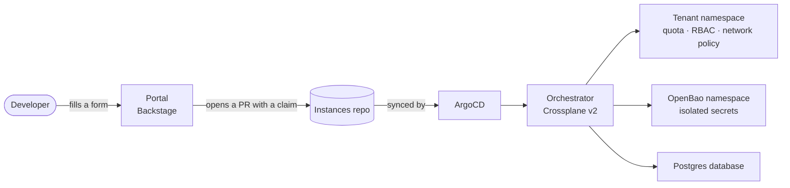

# IdPlatformKit

**A reference Internal Developer Platform, built from open-source building blocks and runnable on your laptop.**

IdPlatformKit shows, end to end, how a platform team can give developers self-service access to secured infrastructure: a team asks for what it needs from a developer portal, and gets an isolated, policy-compliant environment a few minutes later, without opening a ticket.

Everything is designed to be read, run and reused: each design choice is documented, and the whole stack starts locally on [kind](https://kind.sigs.k8s.io/) with no cloud account.

## How it fits together

## Repositories

| Repository | Role | Stack |
|---|---|---|
| [**Orchestrator**](https://github.com/idPlatformKit/Orchestrator) | Self-service infrastructure: a library of Crossplane compositions (`Tenant`, `PostgresDatabase`), end-to-end tested on kind | Crossplane v2, OpenBao, provider-sql, kustomize |
| [**portal**](https://github.com/idPlatformKit/portal) | Developer portal: software catalog, GitHub authentication, org and team sync | Backstage |

## Where it stands

- ✅ Multi-tenant namespaces with per-tenant secrets isolation (OpenBao namespaces + Kubernetes auth)
- ✅ Self-service Postgres databases
- ✅ Backstage portal with GitHub sign-in and group import
- 🚧 GitOps flow: ArgoCD + instances repository
- 🚧 Backstage Software Template creating infrastructure claims
- 🔜 External Secrets Operator, Kyverno guardrails, per-tenant observability

Detailed roadmap in the [Orchestrator issues](https://github.com/idPlatformKit/Orchestrator/issues?q=label%3Aroadmap).

## Write-ups

- TODO_TITRE_ARTICLE_1 : TODO_LIEN_1
- TODO_TITRE_ARTICLE_2 : TODO_LIEN_2

## Contributing

Issues, questions and ideas are welcome. Issues labelled [`good first issue`](https://github.com/idPlatformKit/Orchestrator/labels/good%20first%20issue) are a good starting point.

---

Built by [Anas Touil](TODO_LIEN_LINKEDIN), Platform Engineer (CKA, CKAD).
